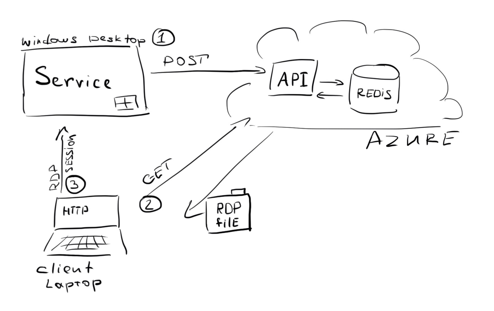
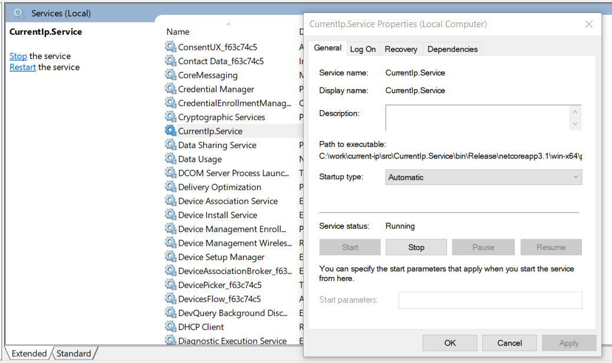

### About

Current-IP is a little pet-project started during the COVID-19 self-isolation.

#### The system in a nutshell



The system consists of two parts:

1. A Windows Service client which is running on the Windows desktop, periodically checks the host machine IP address, and reports it to the API
2. An API service running in Azure, which collects all machine reports, and stored them in a Redis storage

Whenever I or my coworker need to establish an RDP connection to one of the dev machines we can query an API and request a fresh `.rdp` file for that machine.

We cannot use AD discovery capabilities due to a nature of our setup (dev machines are not in a domain), and the VPN server distributes IP addresses randomly.

### Build and run.

Local run:

`docker-compose up -d`

two containers should be brought up and the API should be seen at:

`http://127.0.0.1:8080/api/currentip/latest`

and make sure to get something like that as a result:

```json
{
    "machineName": "name",
    "currentIP": "192.168.1.1",
    "lastSeen": "2020-03-29T09:36:12.6558018+00:00"
}
```

### Build and install a Windows Service

navigate to `CurrentIp.Service` project and run

```
dotnet build

dotnet publish -r win-x64 -c Release
```

note the output, you'll see something like

```
CurrentIp.Service -> C:\work\current-ip\src\CurrentIp.Service\bin\Release\netcoreapp3.1\win-x64\publish\
```

you need a full path, copy it and run (as an Administator):

```
sc create CurrentIp.Service BinPath=C:\work\current-ip\src\CurrentIp.Service\bin\Release\netcoreapp3.1\win-x64\publish\CurrentIp.Service.exe
sc start CurrentIp.Service
```

and you've got it running:



